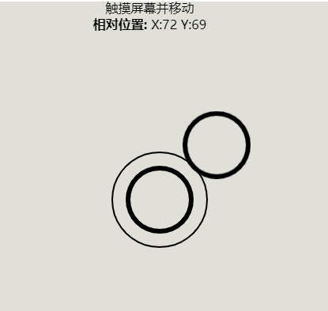

# JavaScript虚拟摇杆
使用原生JavaScript实现的虚拟摇杆，涉及到一些基础的事件监听、canvas绘图、CSS动画。

起初是本人的毕业设计中为控制遥控车的移动而引入了虚拟摇杆，在设计之初参考了[virtualjoystick.js](https://github.com/jeromeetienne/virtualjoystick.js)，后续自己进行了实现。

本项目是对毕设虚拟摇杆进行的复刻与重构。



## 使用方法
分别引入以下三个标签即可
```html
<link rel="stylesheet" href="./joystick.css" />

<div id="joystickContainer"></div>

<script type="text/javascript" src="./joystick.js"></script>
```

# 原理
## 事件
当按压后，响应`touchstart`或`mousedown`事件，获取当前坐标，将摇杆底座和摇杆移动到当前位置，摇杆底座的位置就此固定，而摇杆的位置会随着鼠标/触摸的移动而移动。

触发了`touchmove`或`mousemove`事件后，会获取新坐标，并移动摇杆位置。此处对范围做了限定，摇杆离开摇杆底座的距离不能超过100，移动范围为一个半径为100的圆，如果超过会沿着边缘移动。最后计算出相对圆心的坐标用于显示/发送等处理，由于本项目并没有对数据进行下发，所以此处叫做display坐标。

松开鼠标或者触摸后，响应`touchend`或`mouseup`事件，将摇杆底座和摇杆隐藏，并将display坐标置0。

Web端和移动端分别响应不同的事件，Web端是鼠标事件，移动端是触摸事件，虽然我们对六种事件都进行了监听，但是绝大多数情况下摇杆的应用场景集中在移动端，响应鼠标事件方便我们开发与调试，在正式应用时候可以移除相关代码
```javascript
ele.addEventListener("mousedown", down);
ele.addEventListener("mousemove", move);
ele.addEventListener("mouseup", up);

ele.addEventListener("touchstart", down);
ele.addEventListener("touchmove", move);
ele.addEventListener("touchend", up);
```

## 渲染
摇杆的元素在渲染阶段已经通过`appendChild`方法进行了渲染，但是设置了`visibility: hidden`，不同于`display: none`，后者会将元素从DOM中移除，每次改动会造成重绘和回流，而`visibility`只会造成重绘，这一定程度上可以提高性能，不过由于本项目非常的简单，影响不大
```javascript
ele.style.position = "fixed";
ele.appendChild(baseEle);
baseEle.style.position = "absolute";
baseEle.style.visibility = "hidden";
ele.appendChild(stickEle);
stickEle.style.position = "absolute";
stickEle.style.visibility = "hidden";
```

# 开源协议
本项目采用[MIT协议](LICENSE)